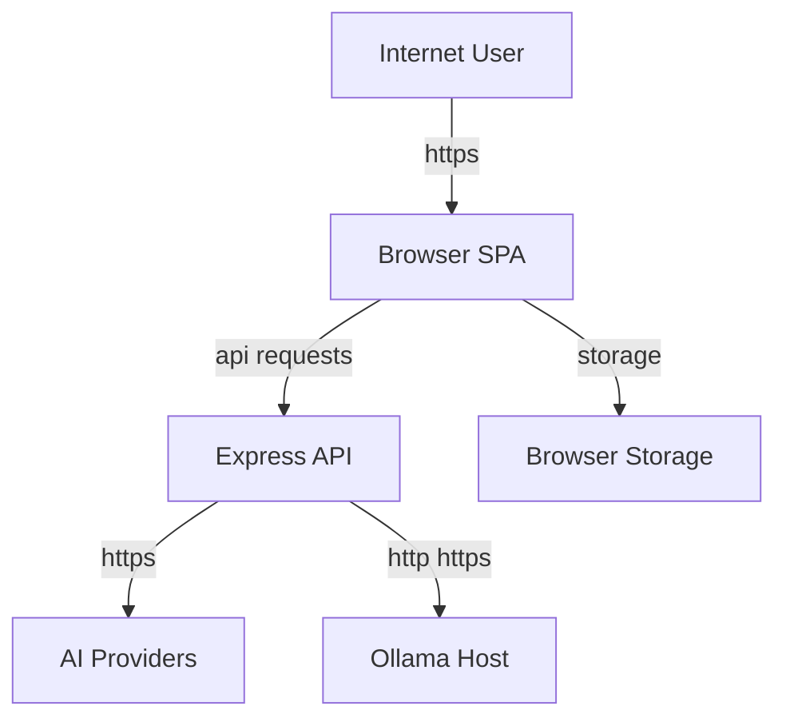

## Executive summary
- As currently implemented, this repository is appropriate for a single-user/local workflow tool, but it is not ready to be exposed as a shared internet-facing service. The top risk themes are: unauthenticated public API proxy abuse in [`server.js`](/c:/Users/addez/Documents/Projects/prompt-workflow-builder/server.js), lack of any tenant/auth model for the stated multi-user deployment target, uncontrolled forwarding of sensitive user-supplied context to third-party model providers, and expansion of attacker-controlled prompt/input surfaces via the existing custom-goal feature in [`src/components/GoalStep.jsx`](/c:/Users/addez/Documents/Projects/prompt-workflow-builder/src/components/GoalStep.jsx) and planned file/URL/note inputs.

## Scope and assumptions
- In scope:
  - Runtime server in [`server.js`](/c:/Users/addez/Documents/Projects/prompt-workflow-builder/server.js)
  - Frontend request, storage, and prompt handling in [`src/lib/aiProviders.js`](/c:/Users/addez/Documents/Projects/prompt-workflow-builder/src/lib/aiProviders.js), [`src/lib/storage.js`](/c:/Users/addez/Documents/Projects/prompt-workflow-builder/src/lib/storage.js), [`src/lib/prompts.js`](/c:/Users/addez/Documents/Projects/prompt-workflow-builder/src/lib/prompts.js)
  - Current user input and rendering flows in [`src/components/GoalStep.jsx`](/c:/Users/addez/Documents/Projects/prompt-workflow-builder/src/components/GoalStep.jsx), [`src/components/WorkflowOutput.jsx`](/c:/Users/addez/Documents/Projects/prompt-workflow-builder/src/components/WorkflowOutput.jsx), and [`src/components/SavedWorkflows.jsx`](/c:/Users/addez/Documents/Projects/prompt-workflow-builder/src/components/SavedWorkflows.jsx)
- Out of scope:
  - `dist/`, `node_modules/`, local dev logs, and non-runtime build assets
  - Supply-chain or CI/CD threats; no CI pipeline is defined in this repo
- Explicit assumptions:
  - The deployment target is a public internet-facing service used by multiple users.
  - Future versions will accept user-supplied free text, uploaded files, URLs, and notes in addition to the current custom goal text.
  - Multi-user/shared usage implies eventual shared persistence, account identity, and tenant isolation even though those components are not yet implemented in this repo.
  - The server may be publicly reachable directly, not only behind the frontend.
- Open questions that would materially change risk ranking:
  - What authn/authz system will gate the public app and API routes?
  - Will provider API keys remain user-supplied in-browser, or will the operator store server-side keys for shared use?
  - Will future file/URL ingestion fetch remote content server-side, client-side, or through a separate processing pipeline?

## System model
### Primary components
- Browser SPA: React/Vite UI that collects business/goal context, stores provider settings and workflows in browser storage, and renders generated outputs. Evidence: [`src/App.jsx`](/c:/Users/addez/Documents/Projects/prompt-workflow-builder/src/App.jsx), [`src/lib/storage.js`](/c:/Users/addez/Documents/Projects/prompt-workflow-builder/src/lib/storage.js).
- Local API proxy/server: Express app exposing provider proxy routes and Ollama helpers, with JSON request parsing capped at 1 MB. Evidence: `app.use(express.json({ limit: '1mb' }))` and `/api/*` handlers in [`server.js`](/c:/Users/addez/Documents/Projects/prompt-workflow-builder/server.js).
- External AI providers: Anthropic, OpenAI, Gemini, and OpenRouter are called outbound by the server with user-supplied API keys. Evidence: `/api/claude`, `/api/openai`, `/api/gemini`, `/api/openrouter` handlers in [`server.js`](/c:/Users/addez/Documents/Projects/prompt-workflow-builder/server.js).
- Optional local/allowlisted Ollama target: server-side proxy to `localhost` or explicitly allowlisted origins via `OLLAMA_ALLOWED_ORIGINS`. Evidence: `validateOllamaUrl` and `/api/ollama*` in [`server.js`](/c:/Users/addez/Documents/Projects/prompt-workflow-builder/server.js).
- Browser-local storage surfaces: settings in `localStorage`, API keys in `sessionStorage`, saved workflows in `localStorage`, JSON export, and clipboard copy. Evidence: [`src/lib/storage.js`](/c:/Users/addez/Documents/Projects/prompt-workflow-builder/src/lib/storage.js), [`src/components/WorkflowOutput.jsx`](/c:/Users/addez/Documents/Projects/prompt-workflow-builder/src/components/WorkflowOutput.jsx).

### Data flows and trust boundaries
- Internet/User Browser -> Browser SPA
  - Data: business selections, custom goal text, future uploaded files/URLs/notes, provider model selections, API keys, generated workflow data.
  - Channel/protocol: HTTPS to frontend.
  - Security guarantees: not defined in repo; no built-in auth/session handling in current code.
  - Validation/normalization: current custom goal text is free-form in [`src/components/GoalStep.jsx`](/c:/Users/addez/Documents/Projects/prompt-workflow-builder/src/components/GoalStep.jsx); prompt interpolation is normalized and length-limited in [`src/lib/prompts.js`](/c:/Users/addez/Documents/Projects/prompt-workflow-builder/src/lib/prompts.js).
- Browser SPA -> Browser storage
  - Data: API keys, selected provider/model, saved workflows, business/goal metadata.
  - Channel/protocol: `sessionStorage` and `localStorage`.
  - Security guarantees: browser-origin scoped only; no encryption, no server-side access control.
  - Validation/normalization: JSON parse/merge in [`src/lib/storage.js`](/c:/Users/addez/Documents/Projects/prompt-workflow-builder/src/lib/storage.js).
- Browser SPA -> Express API routes
  - Data: prompts, provider model IDs, `x-api-key`, Ollama URL, connection-test payloads.
  - Channel/protocol: same-origin HTTP POST/GET to `/api/*`.
  - Security guarantees: no auth, no per-user quotas, no rate limiting, no CSRF/session model; only JSON size limit.
  - Validation/normalization: explicit Ollama URL allowlist in `validateOllamaUrl`; provider error sanitization in [`server.js`](/c:/Users/addez/Documents/Projects/prompt-workflow-builder/server.js).
- Express API -> External model providers
  - Data: prompts containing business/goal context and future custom user content, provider API keys, model IDs.
  - Channel/protocol: outbound HTTPS fetch requests.
  - Security guarantees: TLS via provider HTTPS endpoints; no additional data-loss controls, tenancy enforcement, or content filtering in repo.
  - Validation/normalization: prompt formatting and JSON-only system instruction in [`src/lib/prompts.js`](/c:/Users/addez/Documents/Projects/prompt-workflow-builder/src/lib/prompts.js) and [`server.js`](/c:/Users/addez/Documents/Projects/prompt-workflow-builder/server.js).
- Express API -> Ollama / allowlisted origins
  - Data: prompt text, model IDs, model-list requests.
  - Channel/protocol: HTTP/HTTPS to localhost or allowlisted origins.
  - Security guarantees: origin allowlist only; no user auth or per-user scoping.
  - Validation/normalization: `validateOllamaUrl` rejects non-allowlisted origins in [`server.js`](/c:/Users/addez/Documents/Projects/prompt-workflow-builder/server.js).

#### Diagram

## Assets and security objectives
| Asset | Why it matters | Security objective (C/I/A) |
| --- | --- | --- |
| Provider API keys (`claudeApiKey`, `openaiApiKey`, `geminiApiKey`, `openrouterApiKey`) | Keys can be abused for billing, quota exhaustion, and access to provider accounts. Evidence: [`src/lib/storage.js`](/c:/Users/addez/Documents/Projects/prompt-workflow-builder/src/lib/storage.js), [`src/lib/aiProviders.js`](/c:/Users/addez/Documents/Projects/prompt-workflow-builder/src/lib/aiProviders.js) | C, A |
| User/client business context and future custom notes/files/URLs | May include confidential client data, internal process details, or regulated data once custom input expands. Evidence: [`src/components/GoalStep.jsx`](/c:/Users/addez/Documents/Projects/prompt-workflow-builder/src/components/GoalStep.jsx), [`src/lib/prompts.js`](/c:/Users/addez/Documents/Projects/prompt-workflow-builder/src/lib/prompts.js) | C, I |
| Generated workflows, prompts, and setup guidance | Integrity matters because users may operationalize these outputs in downstream business systems. Evidence: [`src/components/WorkflowOutput.jsx`](/c:/Users/addez/Documents/Projects/prompt-workflow-builder/src/components/WorkflowOutput.jsx), [`src/lib/storage.js`](/c:/Users/addez/Documents/Projects/prompt-workflow-builder/src/lib/storage.js) | I |
| Server availability and outbound provider access | Public abuse can exhaust process resources, provider quotas, or local Ollama compute. Evidence: `/api/*` handlers in [`server.js`](/c:/Users/addez/Documents/Projects/prompt-workflow-builder/server.js) | A |
| Future shared tenant state | For the stated multi-user deployment, shared persistence and account state will become integrity/confidentiality critical. Evidence anchor is absence of auth/storage backend in current repo: [`src/App.jsx`](/c:/Users/addez/Documents/Projects/prompt-workflow-builder/src/App.jsx), [`src/lib/storage.js`](/c:/Users/addez/Documents/Projects/prompt-workflow-builder/src/lib/storage.js) | C, I, A |
| Ollama allowlist configuration | Misconfiguration can expose local/internal model hosts to public callers. Evidence: `EXTRA_OLLAMA_ORIGINS`, `validateOllamaUrl` in [`server.js`](/c:/Users/addez/Documents/Projects/prompt-workflow-builder/server.js) | C, A |

## Attacker model
### Capabilities
- Remote internet attacker can browse the public app and directly call exposed `/api/*` routes if the server is internet-facing.
- Attacker can submit arbitrary custom goal text today via the custom goal flow in [`src/components/GoalStep.jsx`](/c:/Users/addez/Documents/Projects/prompt-workflow-builder/src/components/GoalStep.jsx).
- Under the planned roadmap, attacker may submit files, URLs, notes, and other arbitrary business context.
- Attacker can replay, automate, and volume-test generation or connection-test requests because the current server has no authentication, per-user quotas, or rate limiting in [`server.js`](/c:/Users/addez/Documents/Projects/prompt-workflow-builder/server.js).
- Attacker with browser compromise, malicious extension access, or shared-device access can read `localStorage`/`sessionStorage`.

### Non-capabilities
- A remote attacker cannot currently read another user's browser-local `localStorage`/`sessionStorage` purely over the network without a separate XSS or local compromise.
- The current UI does not use `dangerouslySetInnerHTML`; React renders workflow content as text, which reduces direct stored-XSS risk from model output. Evidence: [`src/components/WorkflowOutput.jsx`](/c:/Users/addez/Documents/Projects/prompt-workflow-builder/src/components/WorkflowOutput.jsx), [`src/components/SavedWorkflows.jsx`](/c:/Users/addez/Documents/Projects/prompt-workflow-builder/src/components/SavedWorkflows.jsx).
- A remote attacker cannot use `/api/ollama` to reach arbitrary URLs unless the target is localhost or explicitly allowlisted by the operator. Evidence: `validateOllamaUrl` in [`server.js`](/c:/Users/addez/Documents/Projects/prompt-workflow-builder/server.js).

## Entry points and attack surfaces
| Surface | How reached | Trust boundary | Notes | Evidence (repo path / symbol) |
| --- | --- | --- | --- | --- |
| `/api/claude` | Browser or direct HTTP POST | Internet -> Express API -> Anthropic | Accepts prompt, model, and `x-api-key`; no auth/rate limit | [`server.js`](/c:/Users/addez/Documents/Projects/prompt-workflow-builder/server.js) / `app.post('/api/claude')` |
| `/api/openai` | Browser or direct HTTP POST | Internet -> Express API -> OpenAI | Accepts prompt, model, and `x-api-key`; no auth/rate limit | [`server.js`](/c:/Users/addez/Documents/Projects/prompt-workflow-builder/server.js) / `app.post('/api/openai')` |
| `/api/gemini` | Browser or direct HTTP POST | Internet -> Express API -> Gemini | Accepts prompt, model, and `x-api-key`; no auth/rate limit | [`server.js`](/c:/Users/addez/Documents/Projects/prompt-workflow-builder/server.js) / `app.post('/api/gemini')` |
| `/api/openrouter` | Browser or direct HTTP POST | Internet -> Express API -> OpenRouter | Accepts prompt, model, and `x-api-key`; no auth/rate limit | [`server.js`](/c:/Users/addez/Documents/Projects/prompt-workflow-builder/server.js) / `app.post('/api/openrouter')` |
| `/api/ollama` | Browser or direct HTTP POST | Internet -> Express API -> Ollama host | Lets caller target localhost/allowlisted Ollama origin | [`server.js`](/c:/Users/addez/Documents/Projects/prompt-workflow-builder/server.js) / `app.post('/api/ollama')`, `validateOllamaUrl` |
| `/api/ollama/models` | Browser or direct HTTP GET | Internet -> Express API -> Ollama host | Exposes reachable model inventory for localhost/allowlisted Ollama | [`server.js`](/c:/Users/addez/Documents/Projects/prompt-workflow-builder/server.js) / `app.get('/api/ollama/models')` |
| `/api/test` | Browser or direct HTTP POST | Internet -> Express API -> provider/Ollama | Lightweight provider validation endpoint; still publicly callable | [`server.js`](/c:/Users/addez/Documents/Projects/prompt-workflow-builder/server.js) / `app.post('/api/test')` |
| Custom goal text input | Browser form input | User input -> prompt construction | Already attacker-controlled today; feeds prompt context | [`src/components/GoalStep.jsx`](/c:/Users/addez/Documents/Projects/prompt-workflow-builder/src/components/GoalStep.jsx) / `customGoal`, [`src/lib/prompts.js`](/c:/Users/addez/Documents/Projects/prompt-workflow-builder/src/lib/prompts.js) / `buildWorkflowPrompt` |
| Browser storage | Browser APIs | App state -> browser storage | Keys in `sessionStorage`, workflows/settings in `localStorage` | [`src/lib/storage.js`](/c:/Users/addez/Documents/Projects/prompt-workflow-builder/src/lib/storage.js) |
| Clipboard / export JSON | UI actions | Generated output -> external user environment | Encourages operational reuse of model output outside the app | [`src/components/WorkflowOutput.jsx`](/c:/Users/addez/Documents/Projects/prompt-workflow-builder/src/components/WorkflowOutput.jsx), [`src/lib/storage.js`](/c:/Users/addez/Documents/Projects/prompt-workflow-builder/src/lib/storage.js) |

## Top abuse paths
1. Public proxy abuse:
   - Attacker discovers the internet-exposed `/api/*` routes.
   - Attacker scripts repeated generation or connection-test requests without needing an account in the app.
   - Express server time, outbound bandwidth, and optionally local Ollama compute are consumed, degrading availability.
2. Ollama exposure via public server:
   - Attacker calls `/api/ollama/models` and `/api/ollama` against a publicly deployed server.
   - The request is forwarded to localhost or an allowlisted internal Ollama target.
   - Attacker enumerates models and burns local compute, or interacts with an internal model that was not intended for public reachability.
3. Sensitive-context exfiltration to third-party models:
   - User enters confidential client notes/files/URLs/business details into the future custom-input workflow.
   - The app forwards that content to Anthropic/OpenAI/Gemini/OpenRouter via the server.
   - Confidential data leaves the service boundary without tenant-specific policy, DLP, or retention controls.
4. Prompt/context manipulation:
   - Attacker crafts custom goal text or future uploaded content to bias model output.
   - The model returns unsafe, misleading, or attacker-influenced workflows and prompts.
   - User copies the generated prompts or workflow steps into external automation systems, causing integrity harm.
5. Browser-side secret exposure:
   - User stores API keys and workflow history in browser storage.
   - Malicious browser extension, XSS introduced later, or shared-device access reads `sessionStorage`/`localStorage`.
   - Attacker gains API keys, client workflow history, and other sensitive context.
6. Multi-tenant architecture gap:
   - The app is deployed as a shared internet service and later adds shared persistence for workflows/files/notes.
   - Authn/authz and tenant isolation are bolted on late or inconsistently.
   - One user can access or overwrite another user's workflows, uploaded context, or provider configuration.

## Threat model table
| Threat ID | Threat source | Prerequisites | Threat action | Impact | Impacted assets | Existing controls (evidence) | Gaps | Recommended mitigations | Detection ideas | Likelihood | Impact severity | Priority |
| --- | --- | --- | --- | --- | --- | --- | --- | --- | --- | --- | --- | --- |
| TM-001 | Remote internet attacker | Server is publicly reachable; attacker can send direct HTTP requests. | Abuse unauthenticated `/api/*` routes for repeated expensive generation or connection-test traffic. | Service slowdown, local Ollama compute drain, operational cost and abuse headroom if server-side keys are later introduced. | Server availability, Ollama compute, future provider spend | JSON body capped to 1 MB via `express.json({ limit: '1mb' })`; provider error messages sanitized. Evidence: [`server.js`](/c:/Users/addez/Documents/Projects/prompt-workflow-builder/server.js) | No authentication, no rate limiting, no per-user quotas, no abuse controls, no request timeouts/backpressure. | Require authenticated users before any `/api/*` access; add per-user and global rate limits; add request timeout/circuit breakers; isolate Ollama routes behind admin/internal controls; add abuse budgets and quotas. | Log route, provider, model, request size, latency, response status, and caller identity/IP; alert on bursts and high error/latency ratios. | High | High | high |
| TM-002 | Remote internet attacker | Public deployment; Ollama enabled or `OLLAMA_ALLOWED_ORIGINS` configured. | Use `/api/ollama` and `/api/ollama/models` to enumerate or consume localhost/allowlisted internal model hosts. | Exposure of internal model inventory, unauthorized use of internal compute, and potential access to internal-only model context. | Ollama host, allowlist config, server availability | `validateOllamaUrl` limits targets to localhost/allowlisted origins. Evidence: [`server.js`](/c:/Users/addez/Documents/Projects/prompt-workflow-builder/server.js) | Any public exposure of these routes still grants anonymous access to the allowed target; no auth or operator confirmation. | Disable Ollama routes in public deployments by default; require authenticated/admin-only access; bind Ollama integration to tenant-owned endpoints only; separate internal and public deployments. | Audit all Ollama route use, including resolved target origin and model; alert on internet-origin access or unusual model enumeration. | Medium | High | high |
| TM-003 | Malicious or careless user; compromised tenant account | Users submit sensitive business data, files, URLs, or notes to generation features. | Sensitive context is forwarded through the server to third-party model APIs without tenant-specific policy or data-governance controls. | Confidentiality/compliance breach, contractual exposure, downstream retention in third-party systems. | Client data, prompts, workflow content, provider accounts | API keys are user-supplied today, reducing central key custody; prompt/error handling is sanitized. Evidence: [`src/lib/aiProviders.js`](/c:/Users/addez/Documents/Projects/prompt-workflow-builder/src/lib/aiProviders.js), [`server.js`](/c:/Users/addez/Documents/Projects/prompt-workflow-builder/server.js) | No consent model, no DLP/PII filtering, no per-tenant provider policy, no audit trail, no retention controls, no region/data-boundary controls. | Add explicit provider consent and data-handling warnings; define allowed data classes; add PII/content filters; support tenant-scoped provider choice and policy; add audit logging and admin controls before enabling shared usage. | Log provider selection, model, tenant/user, and coarse content classification metadata; alert on large/sensitive submissions. | High | High | high |
| TM-004 | Malicious user-controlled input | Attacker can submit custom goal text today; future uploads/URLs/notes extend the same boundary. | Inject prompt/context content that manipulates model behavior, degrades output integrity, or attempts to steer users into unsafe downstream actions. | Incorrect or unsafe business guidance, damaging prompts copied into external systems, loss of trust in generated workflows. | Workflow integrity, downstream automation integrity | Current prompt builder normalizes and length-limits fields, quotes them, and says to treat them as data. Evidence: [`src/lib/prompts.js`](/c:/Users/addez/Documents/Projects/prompt-workflow-builder/src/lib/prompts.js); current custom-goal input in [`src/components/GoalStep.jsx`](/c:/Users/addez/Documents/Projects/prompt-workflow-builder/src/components/GoalStep.jsx) | No schema validation for future rich inputs, no content safety filtering, no confidence/review guardrails before users copy outputs into production tools. | Keep strict prompt/data separation; validate/sanitize future files, URLs, and notes by type; add source attribution and “review before use” warnings; consider policy checks for risky tool suggestions/actions. | Record prompt-source type, parse failures, moderation/filter hits, and repeated model-format failures; review suspicious custom input patterns. | Medium | Medium | medium |
| TM-005 | Browser malware, malicious extension, shared-device user, future XSS | Victim uses the app in an untrusted browser/device or a new XSS path is introduced later. | Read API keys from `sessionStorage` and workflows/settings from `localStorage`, or exfiltrate copied/generated data. | Provider key theft, client workflow disclosure, account billing abuse. | API keys, workflow history, business metadata | Keys are kept in `sessionStorage` instead of `localStorage`; React text rendering avoids direct HTML injection in current components. Evidence: [`src/lib/storage.js`](/c:/Users/addez/Documents/Projects/prompt-workflow-builder/src/lib/storage.js), [`src/components/WorkflowOutput.jsx`](/c:/Users/addez/Documents/Projects/prompt-workflow-builder/src/components/WorkflowOutput.jsx) | Still browser-readable by any script running in origin context; no CSP, no server-side secret isolation, workflows remain in `localStorage`. | Move keys server-side behind authenticated sessions for shared deployments; add CSP and dependency hygiene; minimize browser-stored secrets; add logout/session expiry and optional “clear local data” controls. | Monitor CSP violation reports once enabled; add client-side telemetry for storage clear/use patterns if privacy policy allows. | Medium | Medium | medium |
| TM-006 | Remote authenticated user in planned shared deployment; malicious insider | Shared persistence and multi-user access are added without strong authn/authz and tenant boundaries. | Access, overwrite, or enumerate another tenant's workflows, uploads, notes, or provider configuration. | Cross-tenant confidentiality and integrity breach; potentially catastrophic for a shared SaaS model. | Future tenant data, uploaded files, workflow history, provider config | None in current repo; there is no authn/authz or tenant model. Evidence: absence of auth/session/storage backend in [`src/App.jsx`](/c:/Users/addez/Documents/Projects/prompt-workflow-builder/src/App.jsx), [`src/lib/storage.js`](/c:/Users/addez/Documents/Projects/prompt-workflow-builder/src/lib/storage.js), [`server.js`](/c:/Users/addez/Documents/Projects/prompt-workflow-builder/server.js) | No identity layer, no authorization checks, no object ownership model, no server-side persistence model, no audit logging. | Treat tenant isolation as a first-class design requirement before launch: central identity, server-side authorization on every object access, tenant-scoped storage, audit logs, and authorization tests. | Log subject, tenant, object ID, action, and decision on every future read/write path; alert on cross-tenant access anomalies. | High (for the planned architecture) | High | critical |

## Criticality calibration
- Critical:
  - Any flaw that lets one tenant read or modify another tenant's workflows, uploaded files, notes, or provider configuration in the planned shared deployment.
  - Any public-path design that exposes operator-internal Ollama or internal-only infrastructure to anonymous internet users.
- High:
  - Unauthenticated abuse that can materially degrade service availability or exhaust local/Ollama/provider resources.
  - Uncontrolled forwarding of sensitive customer inputs to external model providers without tenant policy, consent, or auditability.
  - High-confidence misuse of model outputs that drives unsafe downstream automation recommendations.
- Medium:
  - Browser-side exposure requiring local compromise, extension abuse, XSS, or shared-device access.
  - Integrity issues that mislead one user/session but do not directly cross tenant boundaries.
  - DoS or abuse paths with straightforward operational mitigation or that depend on future deployment choices.
- Low:
  - Cosmetic or low-sensitivity leakage from benign UI state.
  - Attacks requiring unrealistic preconditions not supported by current repo behavior.
  - Issues confined to local single-user workflows with no shared backend impact.

## Focus paths for security review
| Path | Why it matters | Related Threat IDs |
| --- | --- | --- |
| [`server.js`](/c:/Users/addez/Documents/Projects/prompt-workflow-builder/server.js) | Core trust boundary, provider proxying, public route exposure, Ollama allowlist, and current absence of auth/rate limiting all live here. | TM-001, TM-002, TM-003, TM-006 |
| [`src/lib/aiProviders.js`](/c:/Users/addez/Documents/Projects/prompt-workflow-builder/src/lib/aiProviders.js) | Client/server request contract, API key forwarding, and error-handling behavior shape secret and abuse exposure. | TM-001, TM-003, TM-005 |
| [`src/lib/prompts.js`](/c:/Users/addez/Documents/Projects/prompt-workflow-builder/src/lib/prompts.js) | Prompt construction is where current and future user-controlled business context crosses into LLM instructions. | TM-003, TM-004 |
| [`src/components/GoalStep.jsx`](/c:/Users/addez/Documents/Projects/prompt-workflow-builder/src/components/GoalStep.jsx) | Already exposes free-text custom goal input, making it the current attacker-controlled prompt source. | TM-004 |
| [`src/lib/storage.js`](/c:/Users/addez/Documents/Projects/prompt-workflow-builder/src/lib/storage.js) | Stores API keys and workflow history in browser storage and defines export behavior. | TM-005, TM-006 |
| [`src/components/WorkflowOutput.jsx`](/c:/Users/addez/Documents/Projects/prompt-workflow-builder/src/components/WorkflowOutput.jsx) | Renders and encourages copying/exporting generated content that may later include attacker-influenced or sensitive outputs. | TM-003, TM-004, TM-005 |
| [`src/App.jsx`](/c:/Users/addez/Documents/Projects/prompt-workflow-builder/src/App.jsx) | Orchestrates save/load flows and shows the current lack of user/account boundary or server persistence. | TM-005, TM-006 |
| [`src/components/SettingsModal.jsx`](/c:/Users/addez/Documents/Projects/prompt-workflow-builder/src/components/SettingsModal.jsx) | Centralizes provider selection and key entry, which become sensitive controls in shared deployment. | TM-003, TM-005 |

## Notes on use
- This threat model is intentionally calibrated for your stated target state: public internet deployment, rich custom inputs, and multi-user/shared usage. Several of the highest-priority issues are architectural blockers for that future state rather than internet exploits against today's local-only storage model.
- Runtime vs dev separation check: covered. The report focuses on the Express runtime, browser storage, prompt handling, and current UI entry points; `dist/`, `node_modules/`, and dev logs are out of scope.
- Entry-point coverage check: covered. All discovered `/api/*` routes, browser custom-goal input, storage surfaces, and export/copy flows are represented.
- Trust-boundary coverage check: covered. Browser -> storage, browser -> API, API -> providers, and API -> Ollama all appear in the system model and threat table.
- Clarification check: incorporated. User confirmed public internet exposure, future free-form/file/URL/note input, and multi-user/shared deployment.
- Assumptions/open-questions check: explicit. The biggest remaining risk drivers are the eventual authn/authz design, persistence model, and how remote content ingestion will be implemented.
